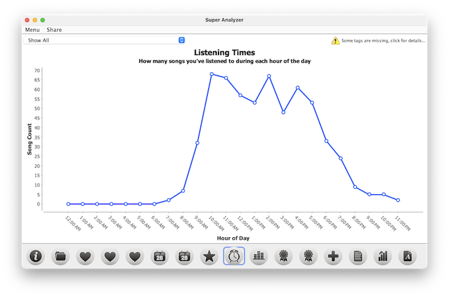
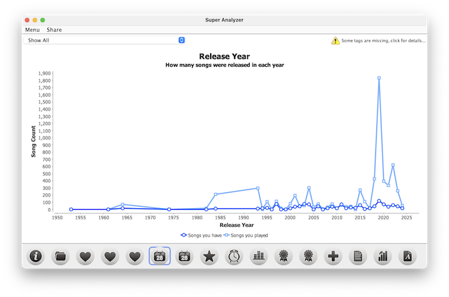
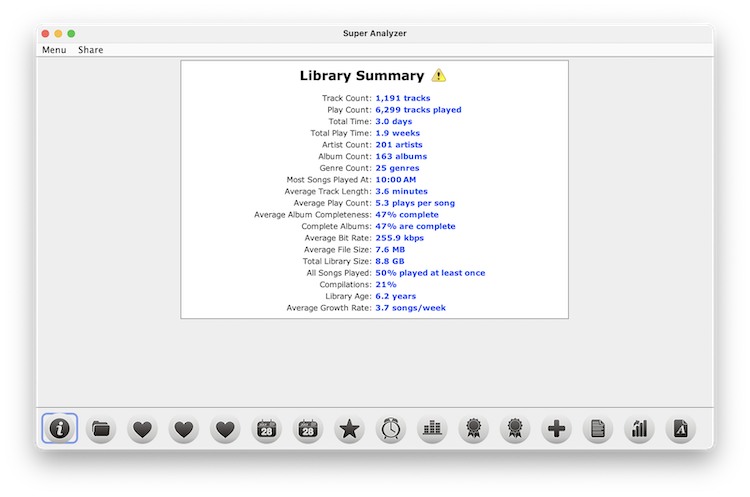

Super Analyzer
==============

Analyzes your Apple Music library and generates a variety of charts about your music collection and listening habits.

## Usage

Prerequisites
- macOS or Windows/Linux with a desktop environment
- Java JDK 11 or newer (javac/java on PATH)

Export your Apple Music library
1. In the Apple Music app, File > Library > Export Library…
2. Save the exported XML file (e.g., `Library.xml`).

Build and run (VS Code)
1. Install the VS Code Extension Pack for Java.
2. Open this folder in VS Code.
3. Run the build task: Terminal > Run Build Task… > `build-super-analyzer`.
4. Start the app: Run and Debug > `Launch Super Analyzer`.

Build and run (Terminal)
```bash
# from repo root
mkdir -p build/classes
find src -name '*.java' -print0 | xargs -0 javac -encoding UTF-8 -d build/classes -cp 'libs/*'
mkdir -p build/classes/media
rsync -a src/media/ build/classes/media/
cp src/*.properties build/classes/

java -cp 'build/classes:libs/*' net.nosleep.superanalyzer.Main
```

Once launched
- Use the UI to select your exported library file.
- Explore tabs for genres, years/decades, play counts, ratings, and more.

## Screenshots







## Similar Projects

- [GraphMyTunes](https://github.com/homebysix/GraphMyTunes)

## License

This project is free software, distributed under the GNU General Public License, version 2 or (at your option) any later version. See the license headers in the source files and visit https://www.gnu.org/licenses/old-licenses/gpl-2.0.html for details.

